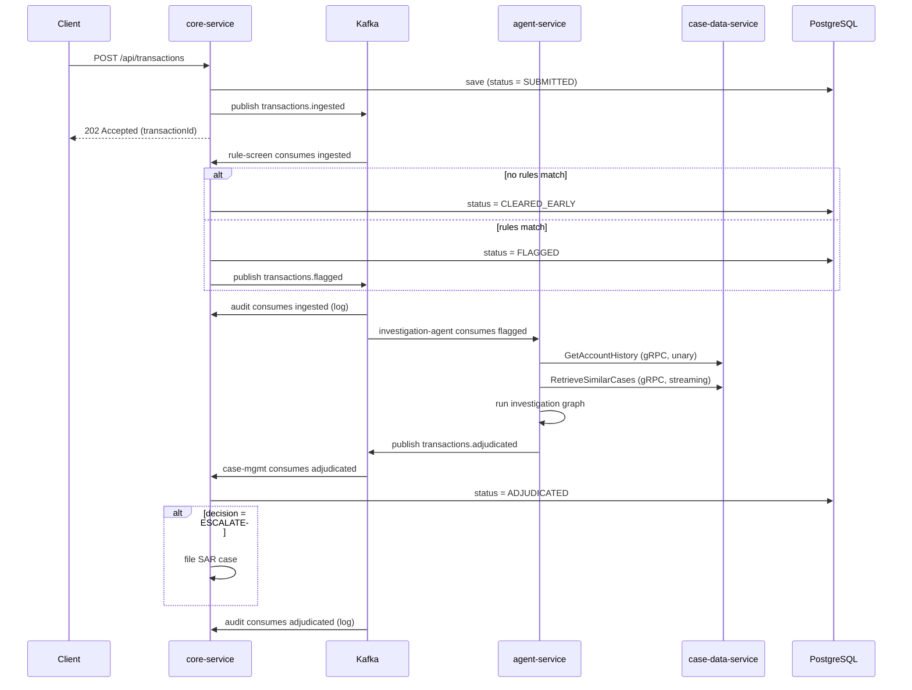
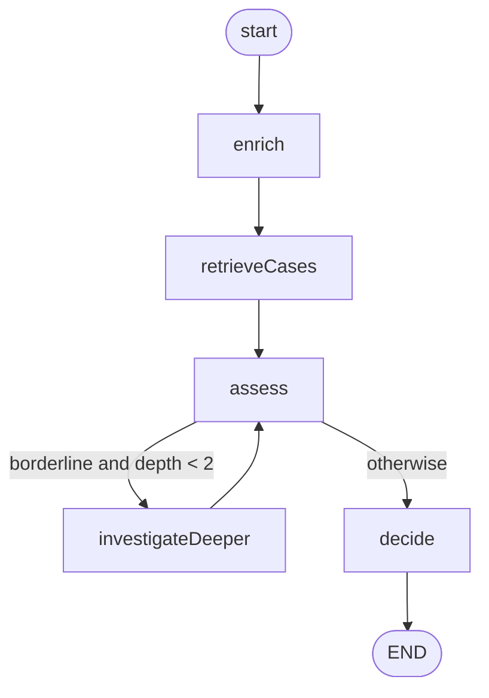
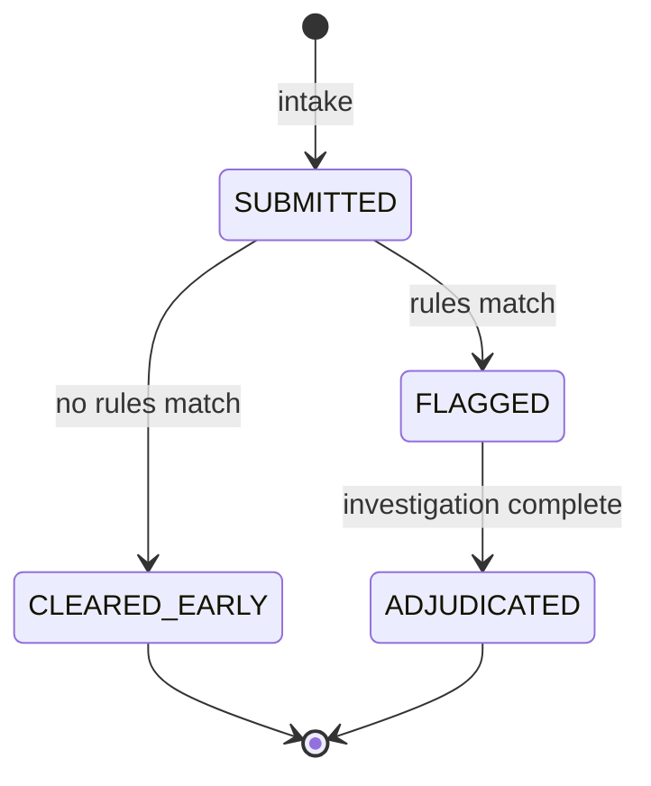

# Architecture

This document describes how TradeSentry is structured, how a transaction moves
through the system, and the key design decisions behind the messaging and
service boundaries.

## Contents

- [Design principles](#design-principles)
- [Service topology](#service-topology)
- [End-to-end event flow](#end-to-end-event-flow)
- [Kafka topics and consumer groups](#kafka-topics-and-consumer-groups)
- [The investigation graph](#the-investigation-graph)
- [gRPC case-data access](#grpc-case-data-access)
- [Transaction lifecycle](#transaction-lifecycle)
- [Key design decisions](#key-design-decisions)

## Design principles

- **Choreography over orchestration.** Services react to events on Kafka topics
  rather than being called by a central coordinator. Each stage owns its own
  logic and advances the transaction by publishing the next event.
- **Independently deployable services.** Each service owns its data and its copy
  of the event contract. Services agree on the JSON/protobuf wire format, not on
  a shared domain jar.
- **Right transport for the job.** Kafka handles asynchronous, ordered,
  fan-out messaging between pipeline stages. gRPC handles synchronous
  request/response lookups within the investigation stage.
- **Deterministic, testable core.** The screening rules, the investigation
  graph, and the synthetic case data are all deterministic, which keeps the
  pipeline reproducible and unit-testable end to end.

## Service topology

| Service             | Inbound                                   | Outbound                                        |
|---------------------|-------------------------------------------|-------------------------------------------------|
| `core-service`      | REST intake; `transactions.ingested`, `transactions.adjudicated` (Kafka) | `transactions.ingested`, `transactions.flagged` (Kafka); PostgreSQL |
| `agent-service`     | `transactions.flagged` (Kafka)            | `transactions.adjudicated` (Kafka); gRPC to `case-data-service` |
| `case-data-service` | gRPC (`GetAccountHistory`, `RetrieveSimilarCases`) | —                                    |

## End-to-end event flow

## Kafka topics and consumer groups

All topics are keyed by `accountId`. Kafka guarantees ordering only within a
partition, and all records sharing a key land on the same partition, so keying
by account gives strict per-account ordering while still allowing different
accounts to be processed in parallel across partitions.

| Topic                       | Partitions | Produced by                     | Consumed by (group)                                          |
|-----------------------------|-----------:|---------------------------------|--------------------------------------------------------------|
| `transactions.ingested`     | 3          | core-service (intake)           | core-service (`rule-screen`), core-service (`audit`)         |
| `transactions.flagged`      | 3          | core-service (screening)        | agent-service (`investigation-agent`)                        |
| `transactions.adjudicated`  | 3          | agent-service (investigation)   | core-service (`case-mgmt`), core-service (`audit`)           |
| `transactions.dlq`          | 1          | (reserved for failed records)   | —                                                            |

**Fan-out.** Kafka delivers every record to each consumer group independently.
`rule-screen` and `audit` both subscribe to `transactions.ingested` in separate
groups, so both receive the full stream without competing for records. The same
applies to `case-mgmt` and `audit` on `transactions.adjudicated`.

## The investigation graph

The agent-service ports LangGraph's core execution model to typed Java. A
`StateGraph<S>` threads a single immutable state value through named nodes,
following edges until it reaches a terminal `END` marker. Two edge types exist:
**fixed edges** always route to a fixed successor, and **conditional edges**
compute the next node from the current state at runtime — which is what enables
both branching and cycles. A `maxSteps` cap guarantees termination even if a
router produces a non-terminating cycle.

The investigation graph is mostly linear with one bounded loop:

| Node                | Responsibility                                                                 |
|---------------------|--------------------------------------------------------------------------------|
| `enrich`            | Fetch account history (risk band, prior SAR) via gRPC                          |
| `retrieveCases`     | Retrieve similar prior cases via gRPC; derive the worst prior outcome          |
| `assess`            | Compute a risk score from the accumulated signals                              |
| `investigateDeeper` | Increment investigation depth; the loop back edge revisits `assess`            |
| `decide`            | Map the final score to a decision and record a rationale                       |

**Risk scoring** (in `assess`) accumulates weighted signals: flag reason
(structuring, high-risk country, large amount), account risk band, prior SAR,
the worst outcome among similar cases, and a small increment per investigation
depth. The score is clamped to `[0, 1]`.

**Decision thresholds** (in `decide`):

| Score        | Decision   |
|--------------|------------|
| `>= 0.70`    | `ESCALATE` |
| `>= 0.40`    | `FLAG`     |
| `< 0.40`     | `CLEAR`    |

A case is **borderline** when the score is in `[0.40, 0.70)`. Borderline cases
loop back through `investigateDeeper` — up to `MAX_INVESTIGATION_DEPTH` (2)
times — before a final decision, giving the extra depth a chance to push the
score across a threshold.

The `assess` node is deterministic and rule-based today; it is the intended seam
for a future model-based scorer (for example, a Spring AI `ChatClient` call that
weighs the same signals).

## gRPC case-data access

During investigation, the agent reads account history and prior cases from
`case-data-service` over gRPC. The proto contract exercises two RPC styles:

- `GetAccountHistory` — **unary** (one request, one response).
- `RetrieveSimilarCases` — **server-streaming** (one request, a stream of
  `SimilarCase` responses drained by the client into a list).

The investigation nodes depend on the `CaseDataClient` interface, not on gRPC
stubs directly. This keeps the graph fully testable with an in-memory fake and
lets the gRPC-backed implementation (`GrpcCaseDataClient`) be swapped in without
touching any node or graph wiring.

The case data returned today is synthetic and deterministic, derived from the
`accountId` hash, so investigations are reproducible.

## Transaction lifecycle

| Status          | Meaning                                                       |
|-----------------|---------------------------------------------------------------|
| `SUBMITTED`     | Received via the intake API; screening has not yet run        |
| `CLEARED_EARLY` | Screening found nothing suspicious; no investigation needed   |
| `FLAGGED`       | Screening flagged the transaction for agent investigation     |
| `ADJUDICATED`   | Investigation finished and a final disposition was recorded   |

## Key design decisions

- **Per-account ordering via message keys.** Keying every topic by `accountId`
  preserves the ordering of a single account's events while allowing parallelism
  across accounts.
- **Duplicated event records per service.** `core-service` and `agent-service`
  each define their own `TransactionEvent` record with an identical shape.
  Consumers ignore the producer's `__TypeId__` header
  (`spring.json.use.type.headers: false`) and bind to their own default type,
  so services stay decoupled at the code level while agreeing on the JSON
  contract.
- **Kafka within a service, gRPC across the investigation boundary.** Async
  events decouple pipeline stages and absorb load; a synchronous gRPC lookup is
  the natural fit for the read-side account/case data the agent needs inline.
- **Bounded graph execution.** The `maxSteps` cap and `MAX_INVESTIGATION_DEPTH`
  ensure the investigation always terminates.
